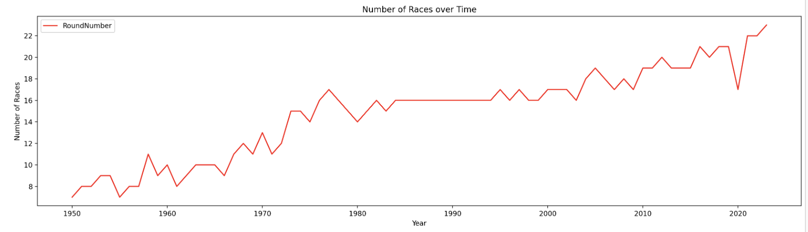
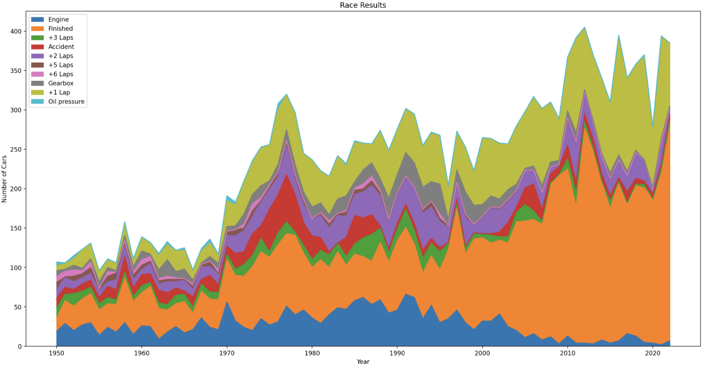
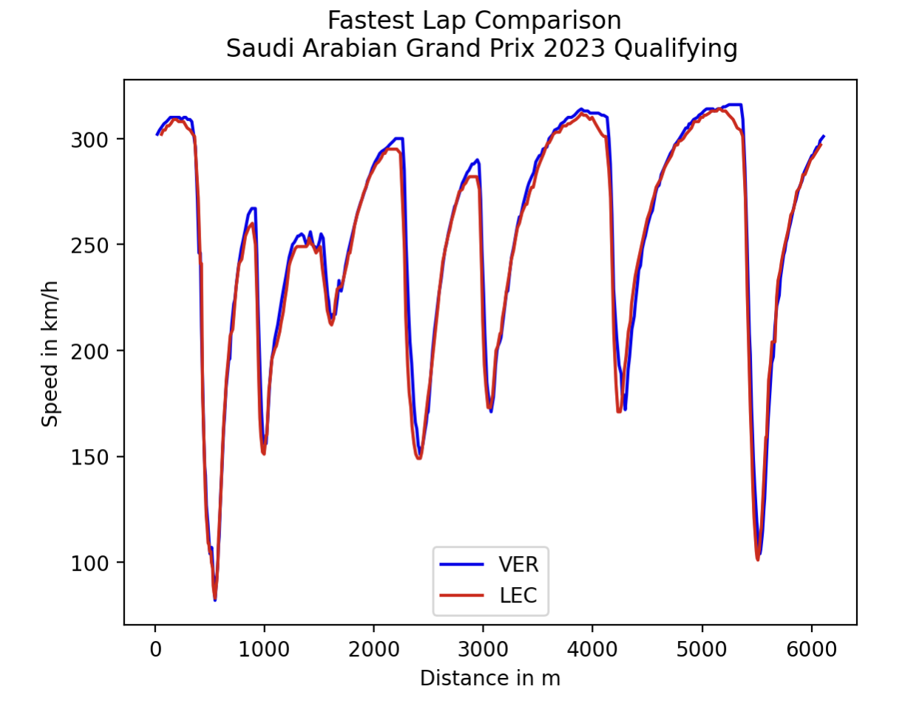
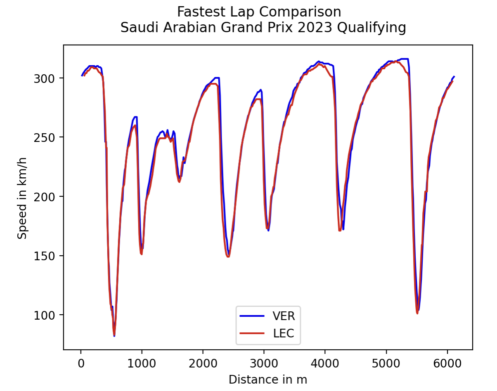

# f1

Doing data analysis on Formula1 motorsport data.

I would ask you to check out this file for F1 analysis - [F1 Analysis](https://github.com/khushmeeet/f1/blob/main/F1%20analysis.ipynb)

But I will paste some of the results here.

